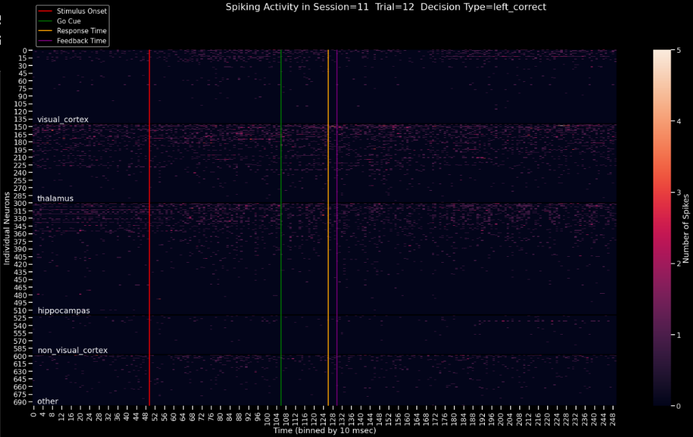

# Spiking Brains

Analysis of the Steinmetz neurons dataset using methods from computational neuroscience and machine learning.



## Content

The modules reside in the package `./app`.

Following are the notebooks that use function from `./app/` to perform analysis.

1. `Exploratory Analysis`
   - Experiment flow across sessions and trials.
2. `Behaviour Analysis`
   - Response to stimulus.
3. `Neurons Analysis`
   - Neuron spikes and firing rate.
4. `Phenomena Analysis`
   - Neuron response with respect to different behaviours.
5. `Machine Learning Modelling`
   - Decoding neuron activity
   - Effect of trial history on current response.

## Installation

### Clone the repository.

```sh
git clone https://github.com/theairbend3r/spiking-brains.git
```

### Install the packages.

Using Conda.

```sh
conda env create -f <environment-name>.yml
```

Using Pip.

```sh
pip install requirements.txt
```

## Meta

Akshaj Verma – [@theairbend3r](https://twitter.com/theairbend3r).

Distributed under the GNU GPL-V3 license. See `LICENSE` for more information.

[https://github.com/theairbend3r/spiking-brains](https://github.com/theairbend3r/spiking-brains)
