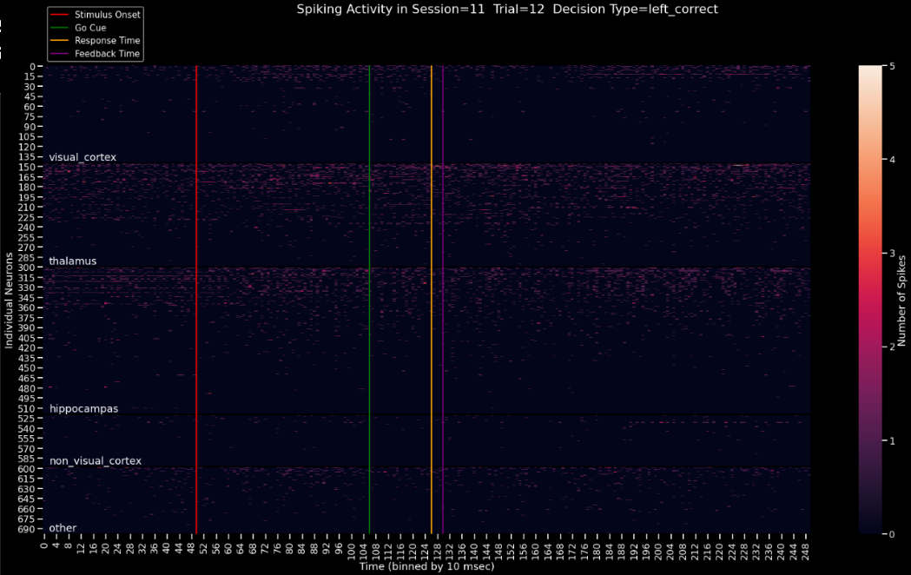

..
   Note: Items in this toctree form the top-level navigation. See `api.rst` for the `autosummary` directive, and for why `api.rst` isn't called directly.

.. toctree::
   :hidden:

   Home page <self>
   API reference <_autosummary/app>

Welcome to Spiking Brains's documentation!
==========================================

.. image:: https://readthedocs.org/projects/spiking-brains/badge/?version=latest
   :target: https://spiking-brains.readthedocs.io/en/latest/?badge=latest
   :alt: Documentation Status

Analysis of the Steinmetz neurons dataset using methods from computational neuroscience and machine learning.

Content
-------

The modules reside in the package ``./app``.

Following are the notebooks that use function from ``./app/`` to perform
analysis.

1. ``Exploratory Analysis``

   -  Experiment flow across sessions and trials.

2. ``Behaviour Analysis``

   -  Response to stimulus.

3. ``Neurons Analysis``

   -  Neuron spikes and firing rate.

4. ``Phenomena Analysis``

   -  Neuron response with respect to different behaviours.

5. ``Machine Learning Modelling``

   -  Decoding neuron activity
   -  Effect of trial history on current response.

Installation
------------

Clone the repository.
~~~~~~~~~~~~~~~~~~~~~

.. code:: sh

   git clone https://github.com/theairbend3r/spiking-brains.git

Install the packages.
~~~~~~~~~~~~~~~~~~~~~

Using Conda.

.. code:: sh

   conda env create -f spiking-brains.yml

Using Pip.

.. code:: sh

   pip install requirements.txt

Meta
----

`Akshaj Verma – @theairbend3r <https://twitter.com/theairbend3r>`_

Distributed under the GNU GPL-V3 license. See ``LICENSE`` for more
information.

https://github.com/theairbend3r/spiking-brains

Indices and tables
==================

* :ref:`genindex`
* :ref:`modindex`
* :ref:`search`